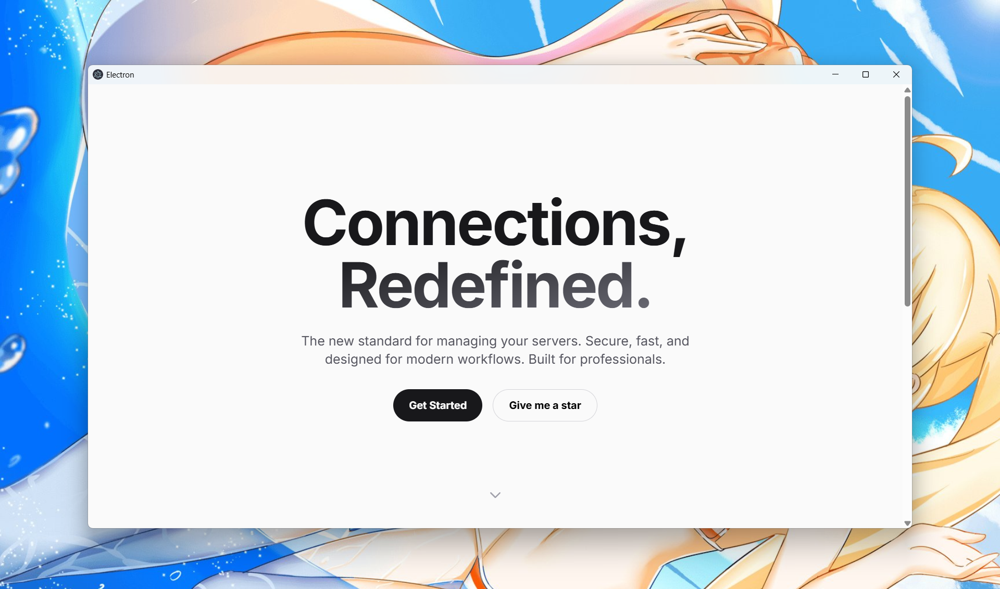

# Electron React Vite Boilerplate



[](https://react.dev/)
[](https://www.electronjs.org/)
[](https://vitejs.dev/)
[](https://tailwindcss.com/)
[](https://opensource.org/licenses/MIT)

A modern, production-ready, and meticulously configured template for building cross-platform desktop applications with a cutting-edge stack.

This boilerplate handles the complex configuration, allowing you to focus on what matters: building your application.

## Features

- **Modern Tech Stack**: Pre-configured with the latest versions of Electron, React, Vite, and Tailwind CSS.
- **Blazing Fast DX**: Powered by Vite for near-instant Hot Module Replacement (HMR) and an exceptional development experience.
- **Type-Safe**: Fully written in TypeScript, ensuring code quality and maintainability across all processes.
- **Secure by Design**:
    - **IPC & External Links**: Implements Electron's best security practices. All external links are opened securely in the default browser through a whitelisted, asynchronous IPC channel.
    - **Navigation Interception**: Prevents all external navigation within the app, enhancing security.
- **Advanced Dark Mode**:
    - **Robust & Persistent**: A full-featured theme management system built with React Context.
    - **System Aware**: Automatically detects and applies the user's system theme on first launch.
    - **User's Choice Saved**: Remembers the user's theme preference via `localStorage`.
- **Engaging UI/UX**:
    - **Apple-Inspired Design**: A clean, modern, and aesthetically pleasing interface.
    - **Interactive Animations**: Features smooth, scroll-based animations and transitions for a polished user experience.
    - **Helpful "Get Started" Page**: A detailed, built-in tutorial to guide new users.
- **Polished Details**: Includes custom-styled scrollbars that adapt to the current theme.
- **pnpm Optimized**: Designed for `pnpm` to ensure fast and reliable dependency management.

## Tech Stack

- **Framework**: Electron, React
- **Build Tool**: Vite
- **State Management**: React Context
- **Styling**: Tailwind CSS
- **Language**: TypeScript
- **Package Manager**: pnpm
- **Font**: Inter

## Getting Started

### Prerequisites

- [Node.js](https://nodejs.org/) (v18 or later recommended)
- [pnpm](https://pnpm.io/installation)

### Installation

1.  **Clone the repository:**
    ```sh
    git clone https://github.com/shuakami/electron-template.git
    cd electron-template
    ```

2.  **Install dependencies:**
    ```sh
    pnpm install
    ```

### Development

To run the application in development mode:
```sh
pnpm dev
```
This command launches the Electron app with the Vite dev server, providing a smooth workflow with Hot Module Replacement.

## Available Scripts

-   `pnpm dev`: Starts the application in development mode.
-   `pnpm build`: Compiles and bundles the application for production into the `out` directory.
-   `pnpm package`: Packages the application for distribution (e.g., `.exe`, `.dmg`). This automatically runs the `build` script first.

## License

This project is licensed under the MIT License. See the [LICENSE](./LICENSE) file for details. 